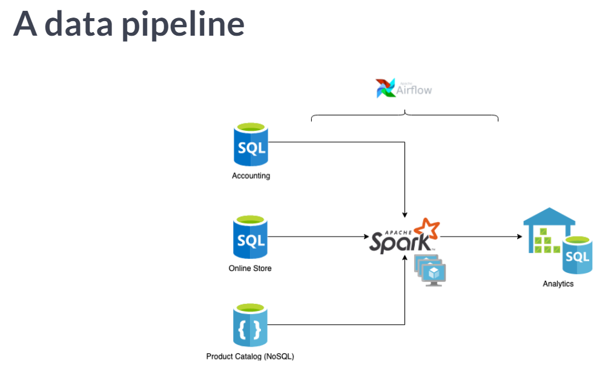

# Menjadi Seorang Insinyur Data
Secara definisi pekerjaan dari insinyur data adalah seorang insinyur yang mengembangkan, mengkonstruksi, tes, dan merawat arsitektur seperti *database* dan *large-scale processing systems.*

Seorang insinyur data mempunyai spesialisasi spesifik pada beberapa aspek teknikal, seperti insinyur data harus mempunyai keahlian automasi / programming skill, desain ETL *(Extract Transfer Load)*, memahami sebuah sistem, modeling data, *SQL* dan *NONSQL* dan beberapa skill yang berkaitan dengan pemrosesan data.

Ada beberapa aspek yang mesti kamu ketahui sebelum kamu menjadi seorang insinyur data ? Aspek yang berkaitan erat dengan insinyur data adalah seperti berikut :

# 1. Basis Data / Database  
Pada aspek yang berhubungan dengan basis data / database ini, seorang insinyur data akan menggunakan alat bantu yang dinamakan database. kenapa database karena didalam database bisa menampung lebih banyak data, support terhadap banyak aplikasi, dan database banyak digunakan alat untuk menganalisa. 

**Contoh Database :** postgreSQL, mySQL dan yang lainnya.

# 2. Pemrosesan / Processing
Pada aspek pemrosesan ini, seorang insinyur data akan menggunakan beberapa alat bantu yang akan membantu nya untuk melakukan proses pembersihan data yang corupt atau tidak terpakai / proses *clean data*, melakukan pengumpulan data yang terpisah pisah menjadi satu / proses *aggregate data* , dan melakukan penggabungan data / proses *join data*.  

**Contoh Processing :** Apache Spark, Hive dan yang lainnya. 

# 3. Penjadwalan / Schedulling
Pada aspek penjadwalan ini, seorang insinyur data akan menggunakan beberapa alat bantu yang akan membantu nya untuk melakukan perencanaan tentang pekerjaan yang dilakukan secara berkala dalam kurun interval waktu tertentu, dan menyelesaikan permasalahan dependency yang dibutuhkan dalam pekerjaan ini.  

**Contoh Schedulling :** Airflow, oozie, cronjobs dan yang lainnya.

dan dari ketiga aspek tersebut akan menjadikan sebuah pipeline yang disebut dengan data pipeline.  
pipeline adalah satu set dari elemen pemrosesan data dihubungkan secara seri, sehingga hasil keluaran dari satu elemen adalah masukkan bagi elemen berikutnya. Elemen - elemen dari sebuah pipeline sering dijalankan secara paralel.

Berikut adalah contoh sederhana dari data pipeline : 

  
*gambar : data pipeline*